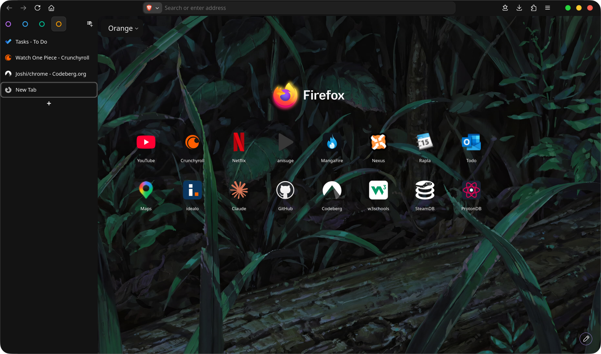
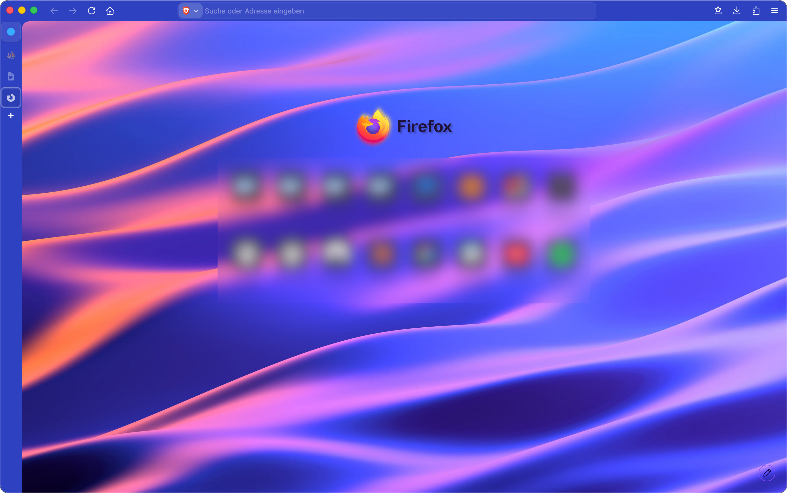
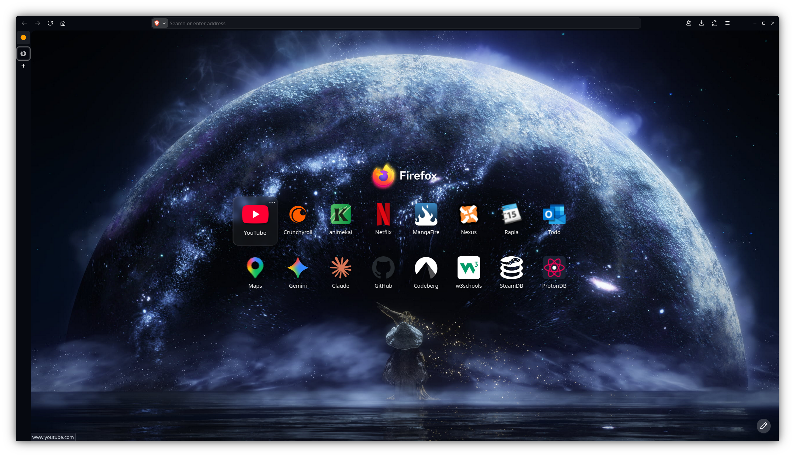
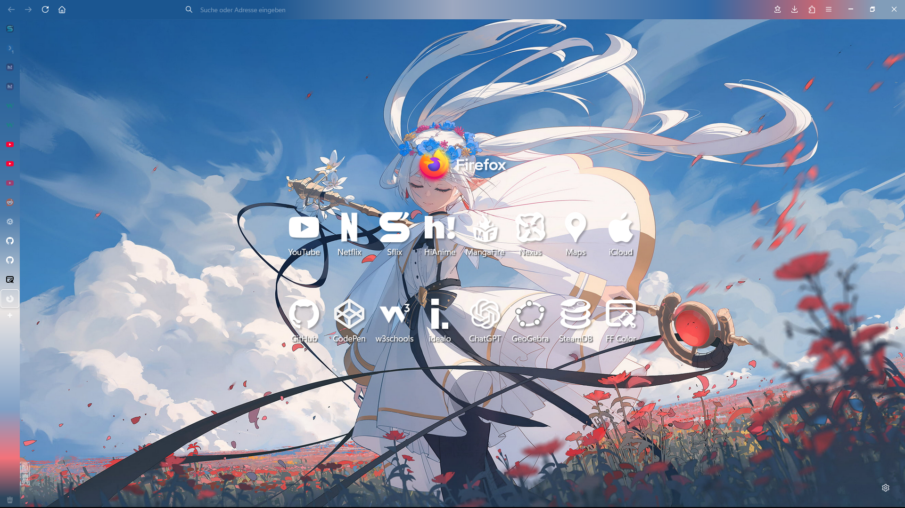

# Better Vertical Tabs on Firefox

This project uses various extensions and stylesheets to enhance the Firefox aesthetic and functionality.

## Screenshots






---

## Installation

### Extensions

The heart of this project is the [Sidebery](https://addons.mozilla.org/de/firefox/addon/sidebery/) extension. It provides the vertical tabs.

For the Firefox theme, I recommend using [Adaptive Tab Bar Color](https://addons.mozilla.org/de/firefox/addon/adaptive-tab-bar-colour/) **or** alternatively [Firefox Color](https://addons.mozilla.org/de/firefox/addon/firefox-color/). This is entirely optional and only alters the appearance.

### Configuration

#### Sidebery

##### Import

Go to the Sibery settings (right-click on the extension > Open settings). Navigate to "Help" and then "Import addon data". Select the newest `configs/sidebery-data-*.json` file.

##### Export

If you want to export your own config, go to the Sidebery settings > Help > Export addon data. Quick overview of the config:

**Changed by this project**:

- Settings
- Panels and navigation bar
- Styles

**Export this if you changed something**:

- Context menu
- Containers config
- Keybindings

**Only recommended for private backups, not sharing**:

- Snapshots
- Sites icons cache

> [!note]
> The horizontal scrolling is somewhat broken, hence why it was limited to one panel per scroll. Also, the settings only apply after reopening the sidebar or opening a new window.

#### Adaptive Tab Bar Color

Not much to configure, but you can go into the extension preferences (in about:addons) and under Advanced change the Home page color to whatever you like.

The Adaptive Tab Bar Color extension cannot access this page; therefore, you need to set the theme manually.

> [!tip]
> Go to the menu > More tools > Eyedropper. Now you can select a color from your Home page wallpaper.

#### Firefox Color

- [Purple theme](https://color.firefox.com/?theme=XQAAAAJ-AgAAAAAAAABBqYhm849SCicxcUEYWXcGHf3p79Ffm06OXtakGWB8WYVdiUdfldDIGArGklQf50jaX9NN8B5fVQPonJyoTUv1cfmNTZm7nJoHBdhc2DAVqFWZ7cq-3zJ9OCzGKhirAc0jBSiIotmeHfQ0kzpiiW7Imn2R8tRQLXS6Xjd-XF9engtfYf3OPbnaLFrukRj5cwa-xiU38e91p_c8rlFvwxqxXL4-gj4FDDvwPi-l011PpxOhpy-EgA0jVExD3O_jWn_uM-WeoKXLRA_wJhFNj_sxx7frwufx6EXMIxsTEeWFTy89Cl9sgCg1m7sqcIM__T4xZmsDv9qoO-0-MJYCzegjGwKVYB4zhg7EYVj-TXzXZV39iPa9)

- [Blue theme](https://color.firefox.com/?theme=XQAAAAJ-AgAAAAAAAABBqYhm849SCicxcUEYWXcGHf3p79Ffm06OXtakGWB8WYVdiUdfldDIGArGklQf50jaX9NN8B5fVQPonIoWmTvxce-kvXqmjXMs06DOaiR4r-hKxtXhVYercgbUo5Aynq1Xra87EacH6Zb9t69ojNAHBIdkxD0O2Gfa15CTiCAfwG2b1YGkMErUBXecRx_7r2j4pJiqVBsXZ_wZutRoK053fWWIxuIWDHeqpLmplc23OobSz55Nep5NiNAw83tn_Vp295fHtfY96yuU3a4525F-X_Z1Xij_XTwmt36ZPKl1NE52yjw5EpnbFpcM2lyXs_yD5kF-LcRE7yhgT7OBy0YsdGv2HjmbfDnqV_-mId5v)

- [Colorful theme](https://color.firefox.com/?theme=XQAAAAKDAgAAAAAAAABBqYhm849SCicxcUEYWXcGHf3p79Ffm06OXtakGWB8WYVdiUdfldDIGArGklQf50jaX9NN8B5fVQPonXibPe3FTG5ny1I9Xl1Vg5bflyZArAsWIWKAA5dkI4P-ud0HL-uFrQM0bb_3MGG0H93jnvKyFfnNhvvM1l35Hdt2qLtEyOyqZGUlqIidWAZ1JtUHiXzMdHsuaSTBpfjtcG491FEtyI1JNF4COj9kYDiPh1XRdU08PLgmrtXim2omMrHamb0OHjPpPm6rOdMApVoIGNl38sCKxopOGEu3OpNePPH4ogFt094QNxkQNznobnDccDu_WHBgJBV_sm3dTaWabjNcSJPdV3Jf_7kNtGA)
    - Side bar gradient for the Colorful theme:

```css
linear-gradient(35deg, #FFE041 16.6%, #FD944C 16.6% 33.3%, #FF453C 33.3% 50%, #DE0E62 50% 66.6%, #B839E5 66.6% 83.3%, #685BDE 83.3%);
```

- [Frieren theme](https://color.firefox.com/?theme=XQAAAAJ_AgAAAAAAAABBqYhm849SCicxcUEYWXcGHf3p79Ffm06OXtakGWB8WYVdiUdfldDIGArGklQf50jaX9NN8B5fVQPonLqdk35VeXM7E0yS6P7GsqCjYnLpplaMrAbZPb8aLjvIqyA-K_qwkRaz-7ANQyWmD96w0RqD2fckVgMY-FP1JqkMy3XkxiRE2DDkWShloPr0yVA8WvLvhtgvKfgm-ZwYJJcO_i7j0B9gqyHh4F7kBhcucyhgDeS-S6_SMzcAHTowWts_1ug4yh3h5qWpJSRSGfxm_7LKCSzphWWw-DzvuubU98Ri80XziXqevKXH7Fganb2Apy7iZzrIRhAloAJzuJFhC7bWwUhebL4cPNhsXyxF-Ap6_g2yXQ)
    - Side and top bar gradient for the Frieren theme:

```css
linear-gradient(90deg, rgba(28,87,145,1) 0%, rgba(26,85,144,1) 30%, rgba(157,168,192,1) 50%, rgba(46,105,167,1) 78%, rgba(194,103,117,1) 90%, rgba(129,157,185,1) 97%);
```

```css
linear-gradient(180deg, rgba(28,87,145,1) 0%, rgba(75,123,171,1) 40%, rgba(233,229,228,1) 60%, rgba(128,160,198,1) 80%, rgba(244,114,122,1) 90%, rgba(44,70,93,1) 98%);
```

### Custom Styling

This project relies on custom CSS added to the Firefox browser.

#### Verify Settings

- Type `about:config` in the search bar.
- Enter `toolkit.legacyUserProfileCustomizations.stylesheets` and make sure it is set to `true`.

> [!warning]
> Otherwise, custom CSS is completely ignored.

#### Install Custom CSS

- Type `about:profiles` in the search bar (this lists all your profiles).
- Go to the profile that says `Default Profile: yes`. This is likely the profile you're using right now.
- In the row `Root Directory` click on `Open Directory`.
- This should take you to your profile directory.
    - _In some cases (e.g., MacOS26), it might only take you to the parent folder of said directory. Simply open the directory with the name of the default profile or copy the directory path from the `about:profiles` page._
- You should now see directories like `bookmarkbackups`, `browser-extension-data`, etc.
- Next, open a terminal inside this directory.
- Run this command: `git clone https://codeberg.org/Joshi/chrome.git`.
- Now you should see a new directory called `chrome`. You might need to restart Firefox now for the changes to apply.

---

## Explanation & Tips

- SCSS files compile to CSS using VSCode extensions like Live Sass Compiler.
- Use Prettier for code formatting
- File Structure:
    - `chrome/` → Where Firefox locates the custom styles userChrome.css and userContent.(s)css.
    - `styleEditor.(s)css` → Is the custom styling for the Sidebery sidebar.
    - `userChrome.(s)css` → Custom styling for the entire Firefox browser.
    - `userContent.(s)css` → Custom styling for the Firefox Home page.
    - `_betterTiles.scss` (optional) → Further styling for the new tab page. It might break after an update, which is why it's opt-in.

### How to Enable the Browser Toolbox

1. Open the Developer Tools Settings (click the ⋯ menu in the DevTools window).
2. Go to the Advanced Settings section.
3. Check the boxes for:
    - Enable browser chrome and add-on debugging toolboxes
    - Enable remote debugging

## TODO

- [ ] Fix pinned tabs size
- [ ] Fix audio symbol outline for panel
- [ ] Bottom bar not visible
